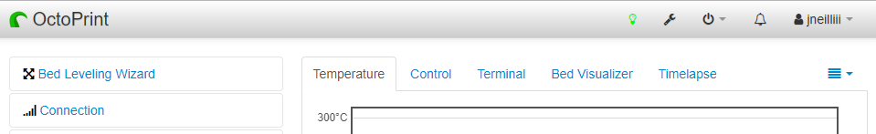
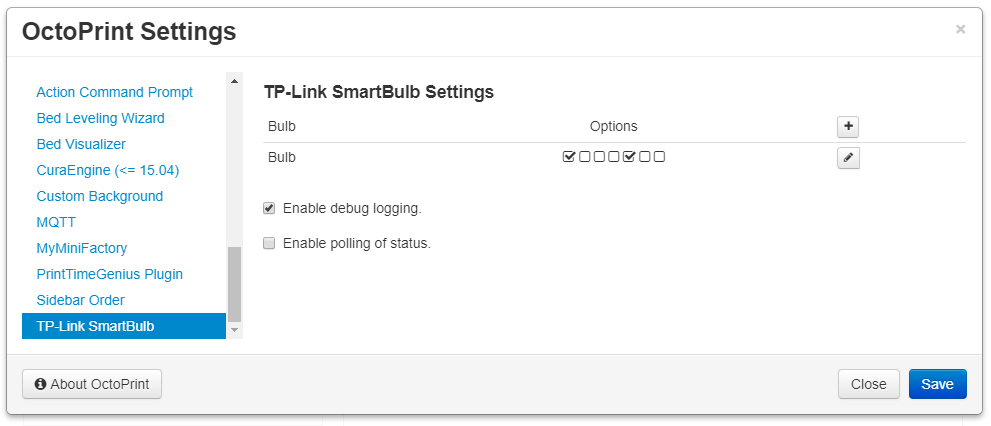
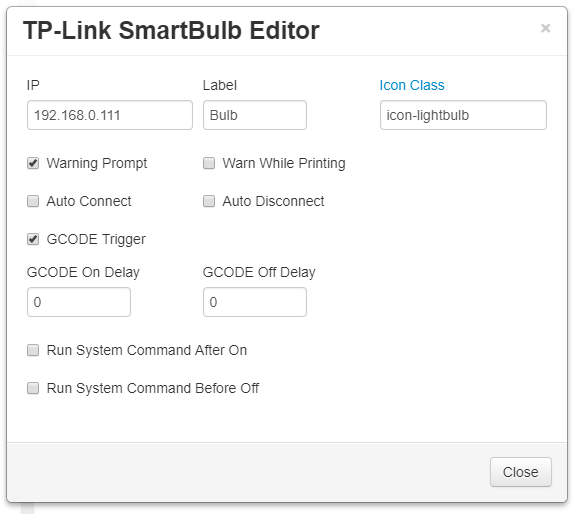

# OctoPrint-TPLinkSmarBulb

Work inspired by [OctoPrint-PSUControl](https://github.com/kantlivelong/OctoPrint-PSUControl) and [TP-Link WiFi SmartPlug Client](https://github.com/softScheck/tplink-smartplug), this plugin controls a TP-Link SmartBulb via OctoPrint's nav bar and GCODE commands.

##  Screenshots

## Setup

Install via the bundled [Plugin Manager](https://github.com/foosel/OctoPrint/wiki/Plugin:-Plugin-Manager)
or manually using this URL:

    https://github.com/jneilliii/OctoPrint-TPLinkSmarBulb/archive/master.zip

## Configuration

Once installed go into settings and enter the ip address for your TP-Link SmartBulb. Adjust additional settings as needed.

## Settings Explained
- **IP**
  - IP or hostname of bulb to control.
- **Label**
  - Label to use for title attribute on hover over button in navbar.
- **Icon Class**
  - Class name from [fontawesome](https://fontawesome.com/v3.2.1/icons/) to use for icon on button.
- **Warning Prompt**
  - Always warn when checked.
- **Warn While Printing**
  - Will only warn when printer is printing.
- **GCODE Trigger**
  - When checked this will enable the processing of M80 and M81 commands from gcode to power on/off bulb.  Syntax for gcode command is M80/M81 followed by hostname/ip.  For example if your bulb is 192.168.1.2 your gcode command would be **M80 192.168.1.2**
  - When enabled M150 GCODE commands will also get translated and submitted to the bulb to change the color of the bulb. Use the format M150 R<value> U<value> B<value> P<value> W<value> I<bulb ip>. For example `M150 I192.168.1.2 R255 G128 B128 P128` will turn the bulb with ip 192.168.1.2 to an orangish color at 50% brightness.
  - **Auto Connect**
  - Automatically connect to printer after bulb is powered on.
  - Will wait for number of seconds configured in **Auto Connect Delay** setting prior to attempting connection to printer.
- **Auto Disconnect**
  - Automatically disconnect printer prior to powering off the bulb.
  - Will wait for number of seconds configured in **Auto Disconnect Delay** prior to powering off the bulb.
- **Run System Command After On**
  - When checked will run system command configured in **System Command On** setting after a delay in seconds configured in **System Command On Delay**.
- **Run System Command Before Off**
  - When checked will run system command configured in **System Command Off** setting after a delay in seconds configured in **System Command Off Delay**.

## Get Help

If you experience issues with this plugin or need assistance please use the issue tracker by clicking issues above.

### Additional Plugins

Check out my other plugins [here](https://plugins.octoprint.org/by_author/#jneilliii)

### Sponsors
- Andreas Lindermayr
- [@Mearman](https://github.com/Mearman)
- [@TheTuxKeeper](https://github.com/thetuxkeeper)
- [@tideline3d](https://github.com/tideline3d/)
- [SimplyPrint](https://simplyprint.dk/)
- [Andrew Beeman](https://github.com/Kiendeleo)
- [Calanish](https://github.com/calanish)
- [Lachlan Bell](https://lachy.io/)
- [Johnny Bergdal](https://github.com/bergdahl)
- [Leigh Johnson](https://github.com/leigh-johnson)
- [Stephen Berry](https://github.com/berrystephenw)
- [Guyot François](https://github.com/iFrostizz)
- [Steve Dougherty](https://github.com/Thynix)
- [Flying Buffalo Aerial Photography](http://flyingbuffalo.info/)
- Sam Fingard
## Support My Efforts
I, jneilliii, programmed this plugin for fun and do my best effort to support those that have issues with it, please return the favor and leave me a tip or become a Patron if you find this plugin helpful and want me to continue future development.

 

<small>No paypal.me? Send funds via PayPal to jneilliii&#64;gmail&#46;com</small>

